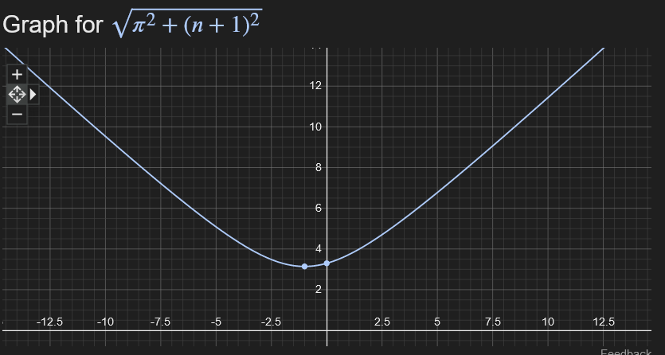

# pythagoras  

   ```[n = Φ * 2]```      n = Golden ratio multiplied by 2.          
   
   ```sqrt(π^2 + (n + 1)^2)  ```  The square root of the sum of pi squared  and  n plus 1 squared.

Pixel generator based on pythagorean theory :

* π^2 = 9.86960440109 
* n+1^2 =  10.485281374 
* π^2 + n+1^2  = 20.3548857751 
* √  20.3548857751 
* =   4.5116389234
**************************************************************************************************************************************************************************************
## Sequence
The sequence : 3.1415926535, 3.236067977, 4.510566367, 5.55252107831, 7.15371926177, 9.05572689525 and so on to ∞ (infinity).

The sequence is 'self-generting' and produces orders of magnitude that are not only proportionate to each other but proportionate to the whole at any given 'moment' in time.
Based on Euclid's "Transitive Property of Equality" , Pythagoras's "Theory of proportion" and the 'Golden Ratio' (Φ) 
The Formulea contains the "Keys" of almost all works of art and architecture (and nature) from the "Hanging gardens of Babylon" and "Solomon's Temple" to the discovery of quasicrystals with
icosahedral symmetry in the 1980's .
**********************************************************************************************************************************************************************
 

### META PHYSICS :The first principle.

* We begin with :  pi = 3.14159265359 = pi to 10 decimal places.(the square root of pi = 1.77245385091 and is equal to a given point in space, ie , the first dimension , or the first 'principle').
* and is both without dimension and outside of , prior to or devoid of 'TIME'. In Modern theory it represents that which preceeds the 'BIG BANG'.
* Then : 2.2360679775 ( the numerator of the golden ratio = the square root of 5 +1 ) =3.2360679775 'This represents the actual moment of the big bang, the inception of 'Time'.
* Calculate the Square of both numbers = 9.86960440109  +  10.485281374 
* Create the sum of the two squared numbers. = 20.3548857751 (the number varies slightly depending on the number of decimal places ).
* Calculate the square root of 20.3548857751 
* This gives us our third number =  4.5116389234 (This is Genesis , the first 'extension' in space and time).
* This is the formulae for generating the sequence : ```sqrt(π^2 + (n + 1)^2)``` where n = the numerator of the 'Golden Ratio'.
* This can be said to be the root principle of the 3rd Dimension of space.(As believed by the ancients).
* Which in and of it's self necessitates the 4th dimension of time.
* The formulae , they believed , is the formulea of 'Eternity'.
* As expressed both in the construction of and the riddle of the 'Sphinx'.
* The propagation of 'the sequence' can be percieved by those within the 'coherence theory of truth' as a 'chain-reaction'
* That continues for 'ETERNITY'...
* Ad INFINITUM...
  
 *************************************************************************************************************************************************************************
  


 ***********************************************************************************************************************************************************************
## reciprocal

 The reciprical 0f sqrt(π^2 + (n + 1)^2) = [ \frac{1}{\sqrt{\pi^2 + (n + 1)^2}} ] 

given that [ n = 2.2360679775 ] (the square root of 5).

 [ \frac{1}{\sqrt{\pi^2 + (2.2360679775 + 1)^2}} = \frac{1}{\sqrt{\pi^2 + 3.2360679775^2}} = \frac{1}{\sqrt{\pi^2 + 10.4721359569}} ]

We Calculate the expression:

\[ \frac{1}{\sqrt{\pi^2 + 10.4721359569}} \]

Using the value of \( \pi \approx 3.14159 \), we have:

\[ \frac{1}{\sqrt{3.14159^2 + 10.4721359569}} = \frac{1}{\sqrt{9.869587132 + 10.4721359569}} = \frac{1}{\sqrt{20.3417230889}} \]

Calculating the square root of 20.3417230889 gives approximately 4.50924975222.

Therefore, the reciprocal of \( \sqrt{\pi^2 + 10.4721359569} \) is approximately \( \frac{1}{4.50924975222} \), which evaluates to approximately 0.22164894331.

 \( n = 2.2360679775 \), the reciprocal of \( \sqrt{\pi^2 + (n + 1)^2} \)  = 0.22164894331.
 
 
 
 
 
 
